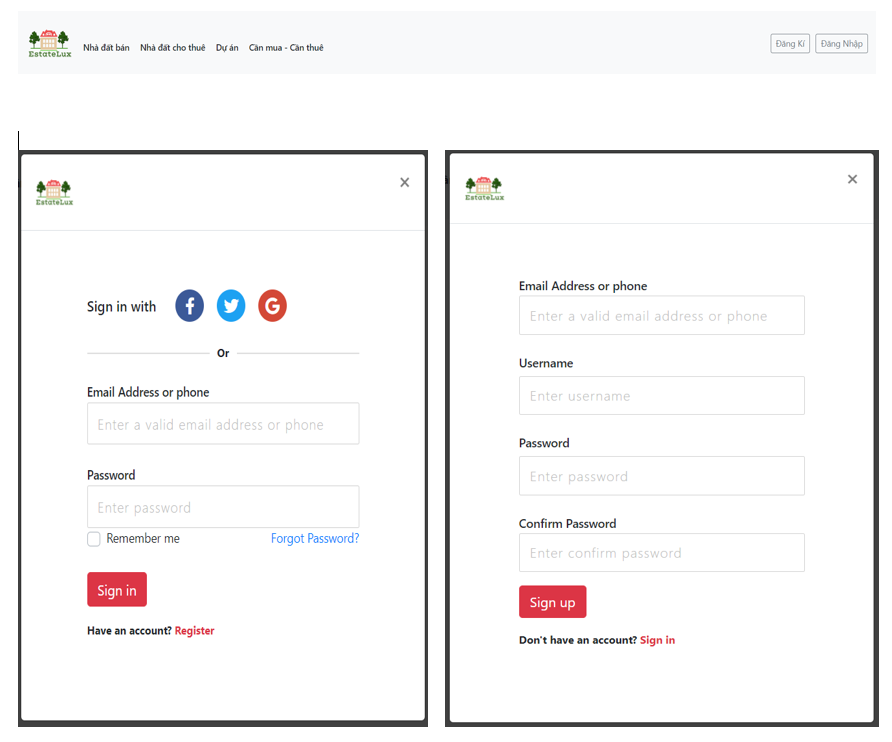

# EstateLux

2021 is considered a promising year for the real estate market with the supply continuing to increase strongly, housing prices are forecasted to increase by 10-15%. Bright market forecasts are a lever for businesses to confidently set big plans for the coming period. In the context of strong supply, real estate businesses have taken advantage of opportunities to promote, brand, and make business plans in 2021. That's why our team wants to build and develop real estate websites to have Can help businesses promote business activities, introduce project proposals to customers, carry out branding Marketing, reach customers anytime, anywhere, is an information channel that helps you easily call call for investment.

<h2>Information</h2>
Manager Project : Nguyễn Thành Long  
Front End : Nguyễn Thành Long  
Back-End : Hà Văn Quang , Hà Phẩm Cương  
Database : Nguyễn Thành Long , Hà Văn Quang  
Data : Nguyễn Trọng Duy An , Hoàng Đức Trường  
Docs : Nguyễn Trọng Duy An, Hoàng Đức Trường  
Design library ,IDE & another : Boostrap 4 , MySQL , Visual Studio Code, Eclipse  
Framework: Spring MVC  
Tool : GitHub , Trello , Discord , ....  

<h2>Information</h2>
<b>Programming languages & another </b>
<table>
  <tr>
    <td valign="top"></td>
    <td valign="top"></td>
    <td valign="top"></td>
    <td valign="top"></td>
  </tr>
</table>

<h2>Documentation</h2>
<a href="https://github.com/LongBody/EstateLux/tree/main/docs">Docs</a>
<h2>Examples</h2>

<h2>License</h2>

This project is licensed under the terms of EstateLux

